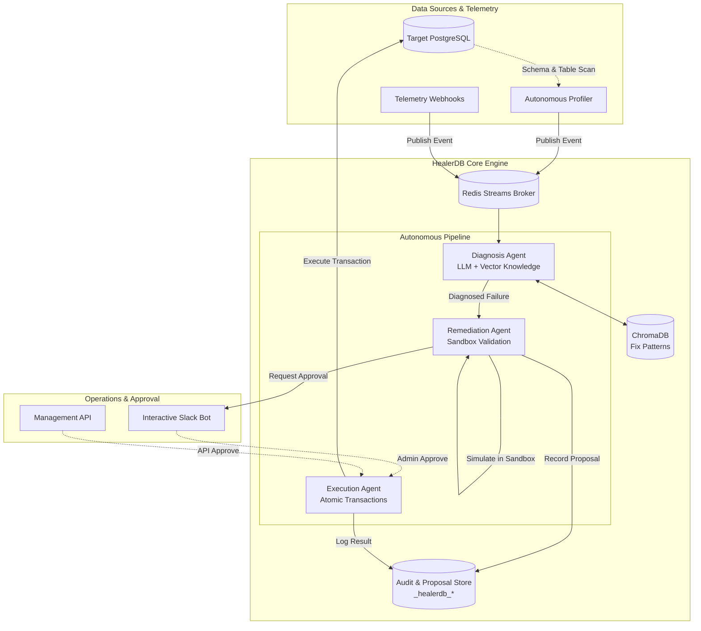
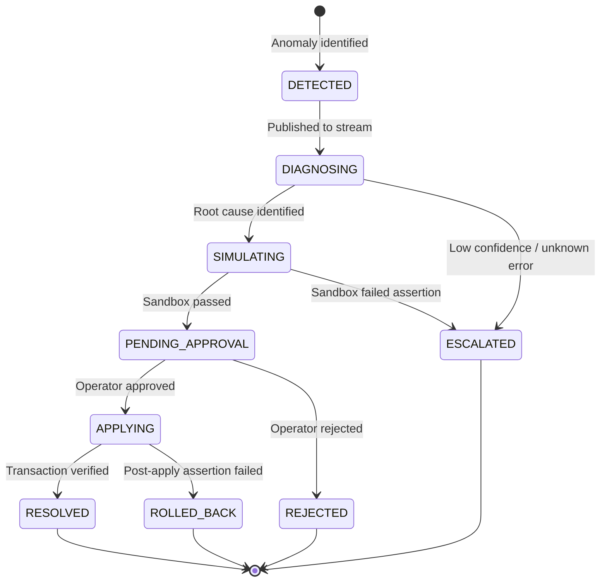

# HealerDB — System Architecture & Design Specification

> **Version:** 1.0.0  
> **Status:** Production  
> **Author:** PranavTJ-05 / HealerDB Core Team  

---

## 1. System Mission & Overview

HealerDB is an autonomous, fail-safe database health monitoring and self-healing engine. While modern observability stacks detect data defects (null leaks, range outliers, broken foreign keys, uniqueness violations), resolving them typically demands high-friction manual interventions.

HealerDB closes this operational loop with an autonomous agent pipeline:
- **Observation**: Real-time telemetry ingestion via webhooks or deep table profiling.
- **Hypothesis & Root-Cause Diagnosis**: Contextual diagnosis powered by LLM reasoning with ChromaDB RAG.
- **Isolated Simulation**: Ephemeral containerized sandbox execution to validate remedies.
- **Human-in-the-Loop Governance**: Interactive proposal dispatch with diff previews and rollback plans.
- **Transactional Enforcement**: Zero-downtime atomic patch execution with post-apply regression tests.

---

## 2. Component Architecture

---

## 3. Infrastructure & Services

HealerDB minimizes external infrastructure overhead, operating with two essential services:

| Service | Technology | Port | Purpose |
|---|---|---|---|
| `healerdb-postgres` | PostgreSQL 16 Alpine | `5433:5432` | Target monitored database & internal metadata repository |
| `healerdb-redis` | Redis 7.2 Alpine | `6379:6379` | High-throughput event streaming & agent work queues |

All application settings are declared in `src/core/settings.py` with dynamic environment overrides.

---

## 4. Operational State Machine

---

## 5. Security & Safety Guarantees

1. **Strict Sandboxing**: No untested SQL runs on production. All proposed DDL/DML scripts are executed against an isolated ephemeral database clone first.
2. **Atomic Rollback**: Execution runs within standard transaction scopes (`BEGIN ... COMMIT`). If post-apply assertions fail, an automatic `ROLLBACK` triggers immediately.
3. **Credential Isolation**: Target database connection strings and credentials are encrypted and never logged in plain text.
